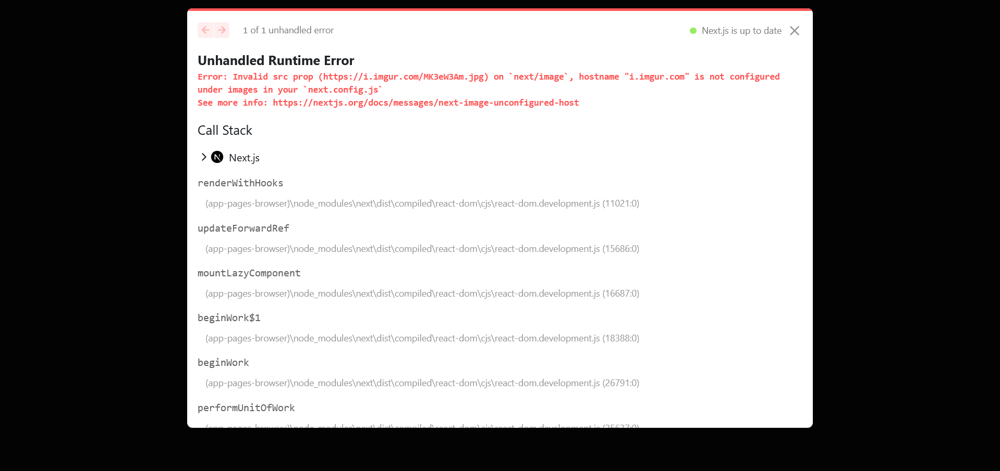
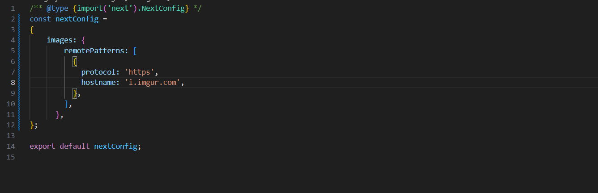
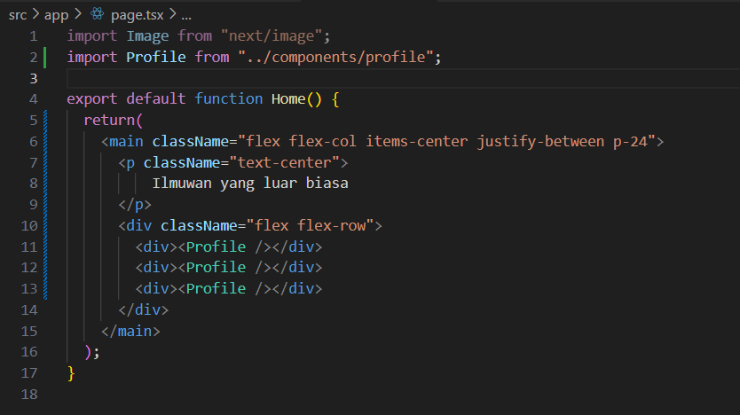
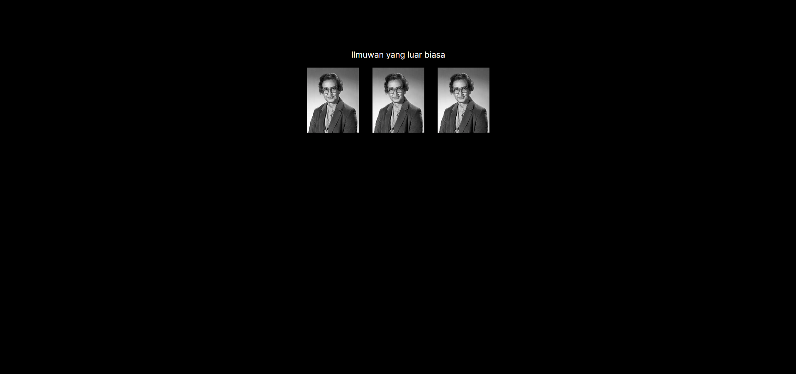
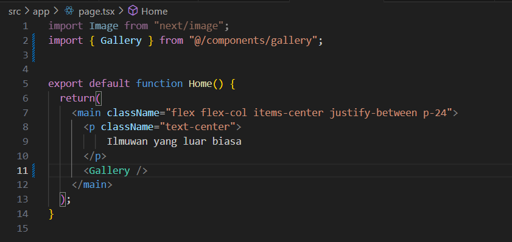

## Laporan Praktikum

|  | Pemrograman Berbasis Framework 2024 |
|--|--|
| NIM |  2141720156|
| Nama |  Versacitta Feodora Ramadhani |
| Kelas | TI - 3I |

### Question 1

    This error is caused by src link of the image, where the link isn't defined in the images.remotePatterns in next.config.js. The solution of this problem is to add a remotePatterns list in next.config.mjs file to specify the protocol, hostname, port, and pathname (if needed) to safely use remote image.
     
     
    In this case, we add i.imgur.com as its hostname, along with https as its protocol. There is no need to add port and pathname since

    The result of the code is as below;

 

### Question 2

    By using the Gallery component, the result is roughly the same as using three Profile components on last practicum, albeit with slight misalignment due to not using flex-col class from Tailwind CSS. However, this shows that one component could use other components inside it, thus enables us for more flexibility in using components and conciseness in code writing.
 
