## Laporan Praktikum

|  | Pemrograman Berbasis Framework 2024 |
|--|--|
| NIM |  2141720156|
| Nama |  Versacitta Feodora Ramadhani |
| Kelas | TI - 3I |

### Question 1

    This error is caused by src link of the image, where the link isn't defined in the images.remotePatterns in next.config.js. The solution of this problem is to add a remotePatterns list in next.config.mjs file to specify the protocol, hostname, port, and pathname (if needed) to safely use remote image.
     
     
    In this case, we add i.imgur.com as its hostname, along with https as its protocol. There is no need to add port and pathname since

    The result of the code is as below;

 

### Question 2

    By using the Gallery component, the result is roughly the same as using three Profile components on last practicum, albeit with slight misalignment due to not using flex-col class from Tailwind CSS. However, this shows that one component could use other components inside it, thus enables us for more flexibility in using components and conciseness in code writing.
 

### Question 3
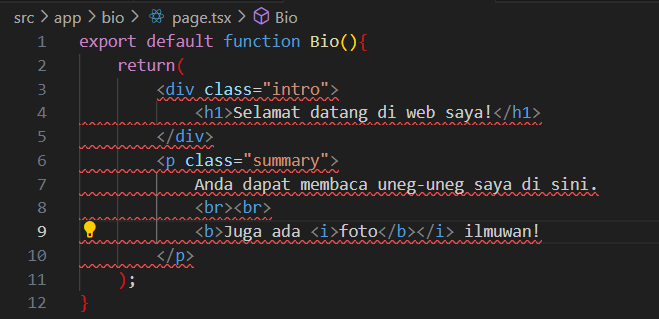
The errors in the written code are as follows;
1. There is no parent element in said code that wraps up other elements, so at least one additional element is needed. In this case, `<main>` element is used.
2. Class property does not exist in JSX, hence the error. In order to label an element, use `className='...'` instead
3. There is no `/` in ` `. Use ` ` instead for line break
4. Tag `</b>` should not be used between `<i></i>` to close bold element. Instead, place `</b>` _after_ `</i>` instead
5. This might be intentional, but in case 'ilmuwan' word is supposed to be in bold, use `</b>` _after_ said word instead, as 'ilmuwan' word needs to be inside bold brackets for it to work.
  
The result would be as follows;
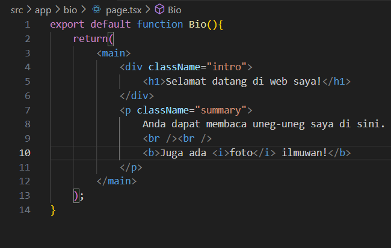
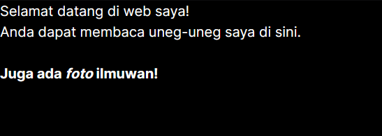
 

### Question 4
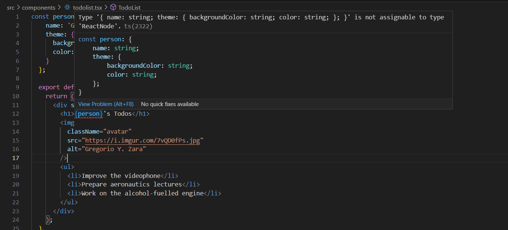
    As per the message above, person is a _list variable_, which means that property listed inside the variable needs to be declared of in order to return a value assigned in said property. In this case, as we need the `name` property, we should call `person.name` instead.

 

### Question 5
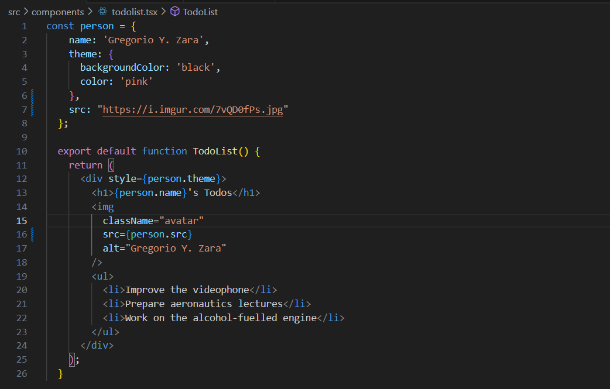
    We could extract the URL from object Person by adding another attribute/property. In this case, by adding `src: "https://i.imgur.com/7vQD0fPs.jpg"` within the list, we can retrieve the URL from said object into src property inside `` element by calling `person.src`.
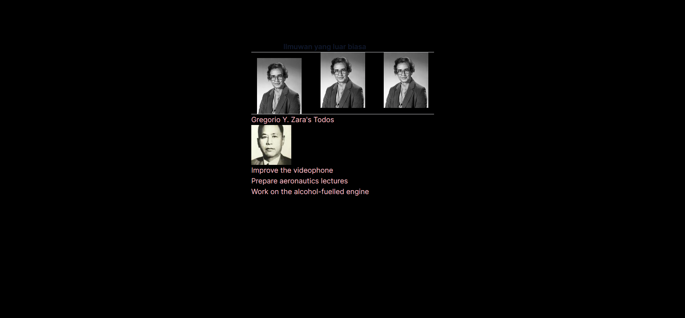
From the experiment, the image remains the same because the URL used is also the same one as before--only the URL declaration method is different.
 

### Question 6
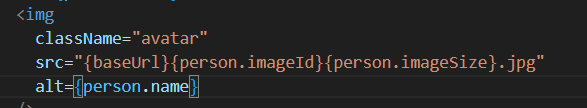
The src above would only form the text `{baseUrl}{person.imageId}{person.imageSize}.jpg`, which is by no means not a valid URL for imgur, and will return an empty data instead.
In order to concat several different attributes into one, we only need to use one pair of bracket and combine them by using + operator.
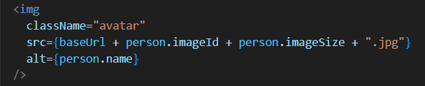
By using this, the src will be detected as `https://i.imgur.com/7vQD0fPs.jpg`, which is a valid URL to retrieve an image from imgur.
 
By using the concatenation method above, the url source will be the same as previous practicum, thus there is no change in its image display.

 

### Question 7
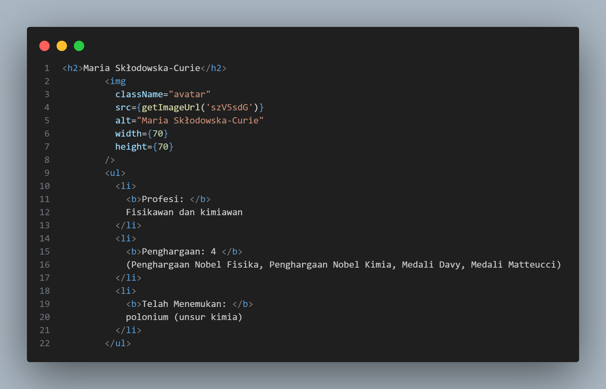
In this code, the similar attributes are as follows;
- Name of the scientist
- Image attribute
- List of profession, achievements, and their inventions
  
Because of this, we need to separate those attributes into props to reduce duplication within our code. MyGallery page is placed under `app/mygallery/page.tsx` and the component MyProfile is placed under `components/myprofile.tsx` for easier navigation.
 

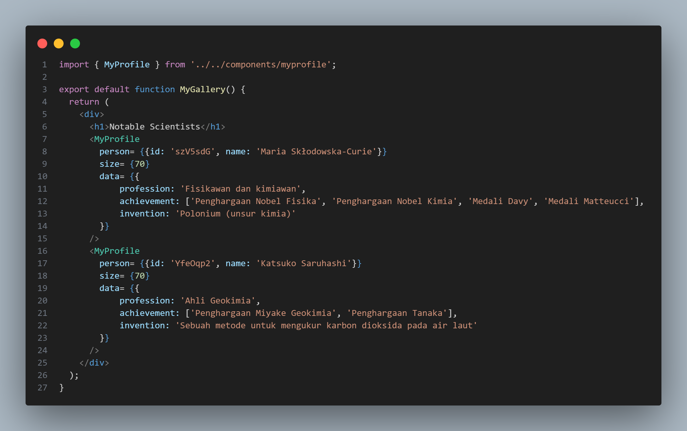
From the code above, it is shown that the props used are as follows;
- Person object with attribute id (for imgur id) and name
- Size attribute for image width and length
- Data object, which consists of various attributes such as profession, achievements (in form of array to make it easier to count how many achievements they have), and inventions
  
The result is below;
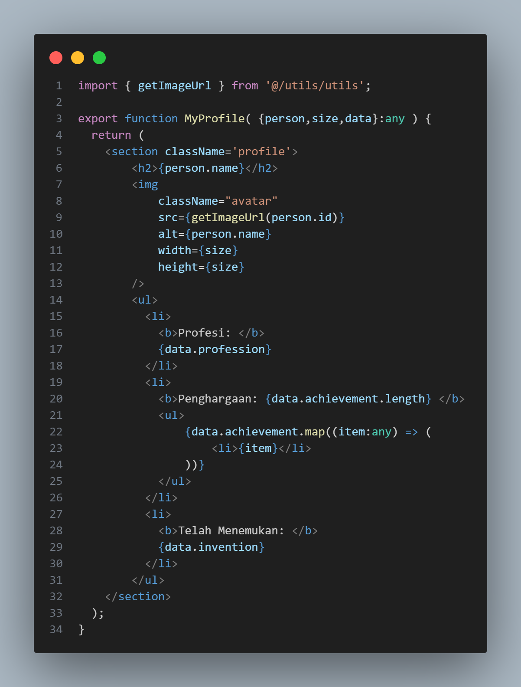
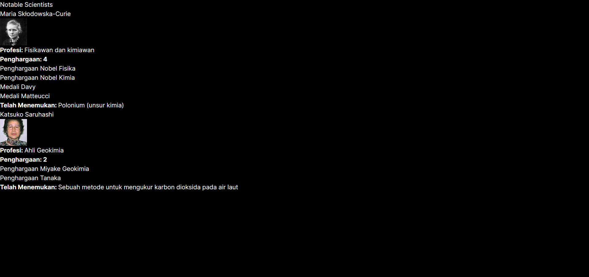
 

### Question 8
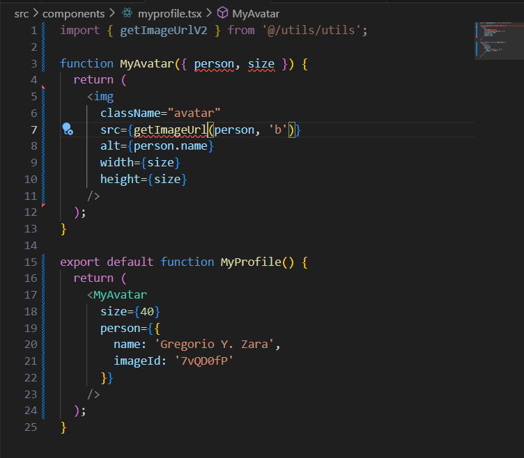
There are several errors detected, which are;
1. There isn't any explicit declaration that the datatype of the parameters are `any`, so it needs to be declared outside the parameter bracket
2. The imported component name is `getImageUrlV2` and not `getImageUrl`, hereby the line 7 needs to be changed
  
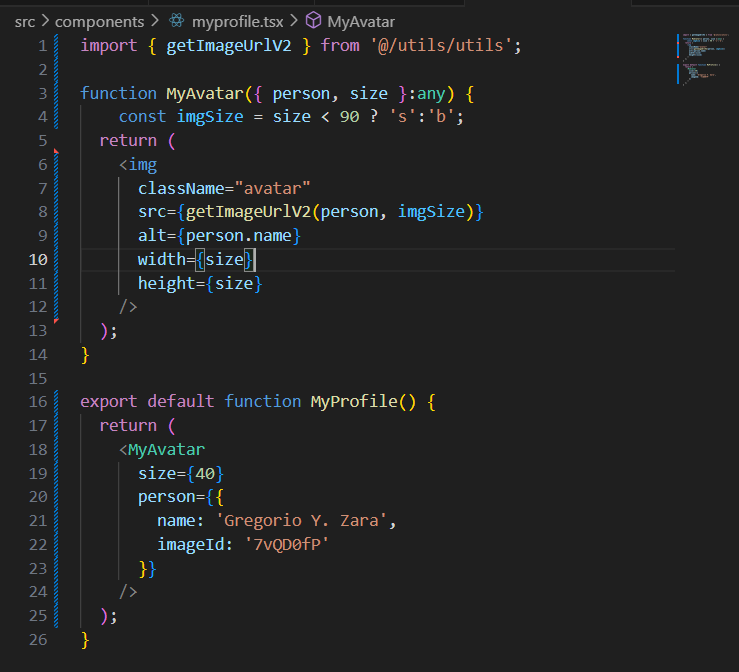
In addition, creating new variable inside the `MyAvatar` function and add else-if condition in line 4 would allow us to change the parameter from 'b' to 's'.
 